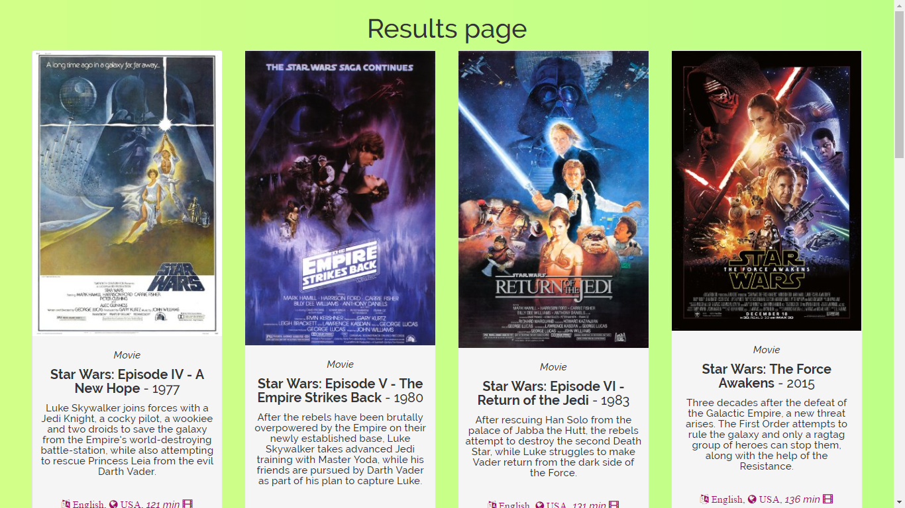
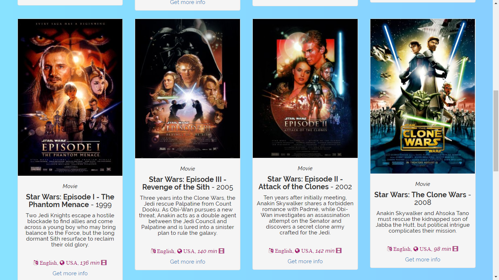
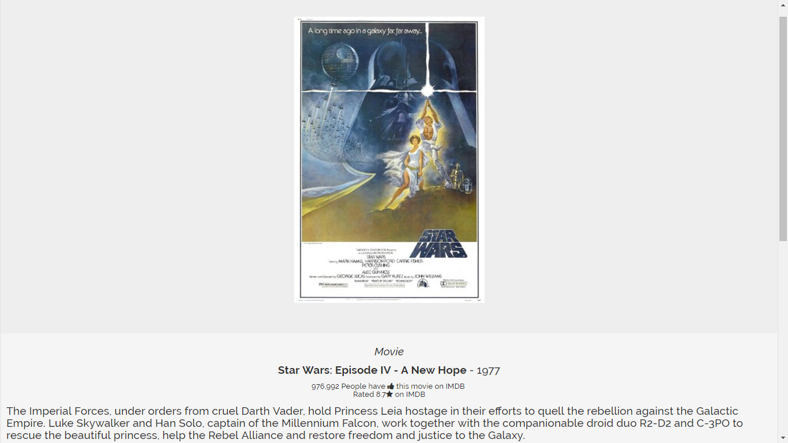
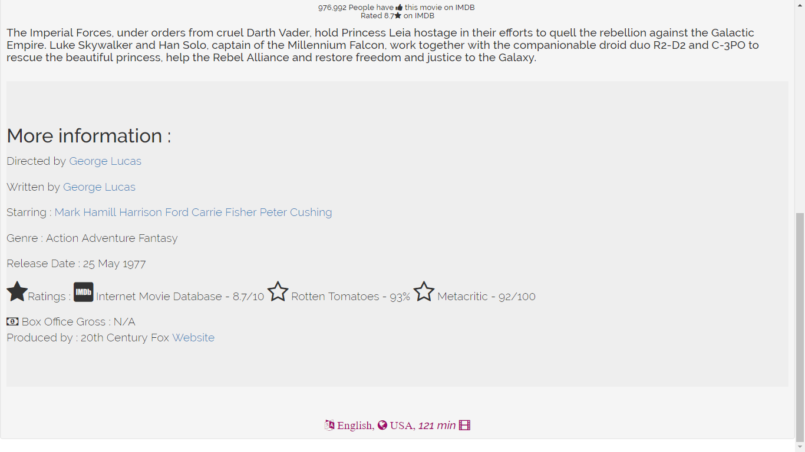

# Movie Search App
- Uses Open Movie Database's API

Usage : 

        `git clone https://github.com/theamanbhargava/movieDB.git`
        
        `cd movieApp`
        
        `npm install`
        
- Set values for enviornment variables :
        
        `IP : Desired IP address`
        `PORT : Desired Port Number`
        `KEY` : API-KEY obtained from OMDB

Screenshots :  
  
  
  
  
